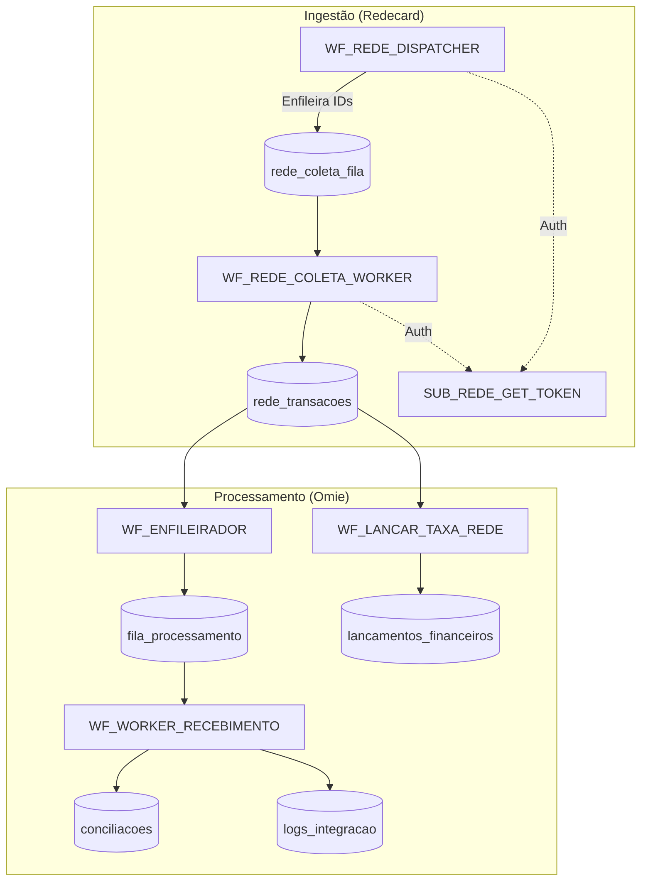

# 📦 ARQUITETURA COMPLETA — CONCILIAÇÃO REDE + ERP OMIE (V2)

## 📝 RESUMO DE CONTEXTO (Para IA e Desenvolvedores)

**Status Atual**: Projeto em fase final de implementação e validação.
**Contexto**: Integração robusta e distribuída entre a API da Redecard e o ERP Omie. O sistema foi migrado de uma arquitetura monolítica para um modelo de **Dispatcher/Worker** baseado em filas no PostgreSQL, garantindo alta escalabilidade e tolerância a falhas.

**Principais Entregas**:
1.  **Autenticação Inteligente**: Sub-workflow `SUB_REDE_GET_TOKEN` que gerencia tokens OAuth2 sob demanda com bloqueio de concorrência.
2.  **Ingestão em Duas Etapas**: Separação entre a listagem de pagamentos (`Dispatcher`) e a coleta de detalhes das parcelas (`Worker`), evitando gargalos na API da Rede.
3.  **Conciliação de Alta Performance**: O worker de recebimento consulta um cache local de títulos (`titulos_contas_receber`) antes de interagir com a API da Omie, reduzindo drasticamente o tempo de processamento.
4.  **Gestão Automática de Taxas**: Workflow dedicado para lançar e pagar as taxas administrativas da Redecard no Omie como contas a pagar.
5.  **Estados Terminais Claros**: Diferenciação entre erros de negócio (`TITULO_NAO_LOCALIZADO_NSU`) e erros técnicos (`ERRO_API_OMIE`), permitindo auditoria precisa.

**Próximos Passos Planejados**:
- Implementação de um workflow de **Tratamento de Exceções** para analisar itens em `ERRO_FINAL` e reativar (voltar para `PENDENTE`) casos elegíveis após correção manual ou sistêmica.

---

## 🎯 Objetivo

Automatizar o ciclo financeiro completo das vendas via REDECARD:
- Coleta distribuída e escalável de transações.
- Autenticação sob demanda e thread-safe.
- Armazenamento seguro com controle de concorrência.
- Conciliação automática com títulos do ERP Omie.
- Lançamento e pagamento automático de taxas administrativas.
- Controle rigoroso de erros, retries e estados terminais.

---

## 🧠 VISÃO GERAL DA ARQUITETURA

O sistema opera de forma distribuída para garantir escalabilidade e resiliência:

---

## 🟦 WORKFLOWS DE INGESTÃO (REDE)

### 1. WF_REDE_DISPATCHER
- **Função**: Identifica pagamentos na API da Rede e enfileira para coleta detalhada.
- **Diferencial**: Usa `Loop Empresas` para processar cada empresa individualmente com segurança.
- **Saída**: Insere registros na tabela `rede_coleta_fila`.

### 2. WF_REDE_COLETA_WORKER
- **Função**: Coleta os detalhes (parcelas) de cada `payment_id`.
- **Diferencial**: Processamento paralelo. Usa `lock_rede_coleta` para garantir que um worker não pegue o item do outro.
- **Saída**: Upsert na tabela `rede_transacoes`.

### 3. SUB_REDE_GET_TOKEN (Serviço On-Demand)
- **Função**: Gerencia o ciclo de vida do token da Rede.
- **Diferencial**: Só renova se o token estiver expirado (ou perto de expirar). Usa `FOR UPDATE` no banco para garantir que múltiplos workers não tentem renovar o token da mesma empresa ao mesmo tempo.

---

## 🟨 WORKFLOWS DE PROCESSAMENTO (OMIE)

### 4. WF_ENFILEIRADOR
- **Função**: Move transações `PENDENTE` de `rede_transacoes` para a `fila_processamento`.
- **Diferencial**: Operação em lote (Batch) com registro de log por empresa.

### 5. WF_WORKER_RECEBIMENTO
- **Função**: Localiza o título no banco de dados local (`titulos_contas_receber`) e realiza a baixa no Omie.
- **Diferencial**: 
    - Busca local para alta performance.
    - Cálculo automático de juros/desconto.
    - Tratamento de estados terminais (`TITULO_NAO_LOCALIZADO_NSU`, `ERRO_API_OMIE`).
- **Escalabilidade**: Pode ser replicado em N instâncias (Worker 01, 02, etc).

### 6. WF_LANCAR_TAXA_REDE
- **Função**: Identifica transações processadas com taxa > 0 e realiza o lançamento/pagamento da despesa no Omie.
- **Saída**: Registra em `lancamentos_financeiros` e vincula o `omie_taxa_id` na transação original.

---

## 🧱 ESTRUTURA DE DADOS (PostgreSQL)

### Principais Tabelas
- **`empresas`**: Cadastro central com `rede_empresa_id` e `omie_empresa_id`.
- **`rede_transacoes`**: O "coração" do sistema. Armazena cada parcela e seu status de conciliação.
- **`fila_processamento`**: Gerencia a ordem e as tentativas de integração com o Omie.
- **`logs_integracao`**: Auditoria detalhada de erros técnicos e payloads de API.

### Estados da Transação (`status_processamento`)
- `PENDENTE`: Aguardando processamento.
- `PROCESSANDO`: Sendo manipulada por um worker.
- `PROCESSADO`: Sucesso total.
- `TITULO_NAO_LOCALIZADO_NSU`: Erro de negócio (Título não encontrado no ERP).
- `ERRO_API_OMIE`: Erro técnico na comunicação com o Omie.
- `ERRO_FINAL`: Excedeu o limite de 5 tentativas de retry.

---

## 🔐 MECANISMOS DE SEGURANÇA

1. **Controle de Concorrência**: Uso de `FOR UPDATE SKIP LOCKED` em todas as funções de Lock.
2. **Idempotência**: Índices `UNIQUE` em todas as tabelas críticas para evitar duplicidade de dados, mesmo em caso de reprocessamento.
3. **Isolamento de Erros**: Falhas em uma empresa ou transação não interrompem o fluxo das demais.

---

## 🚀 ESCALABILIDADE (Workers)

O sistema foi desenhado para crescer horizontalmente. Para aumentar a velocidade de processamento:
1. Duplique o workflow `WF_WORKER_RECEBIMENTO`.
2. Altere o ID do worker na chamada da função: 
   `SELECT lock_rede_transacao($1, 'worker-recebimento-02');`
3. O banco de dados gerenciará automaticamente a distribuição da carga entre os workers.
